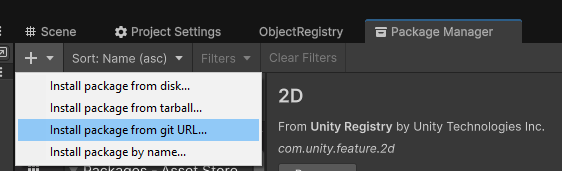
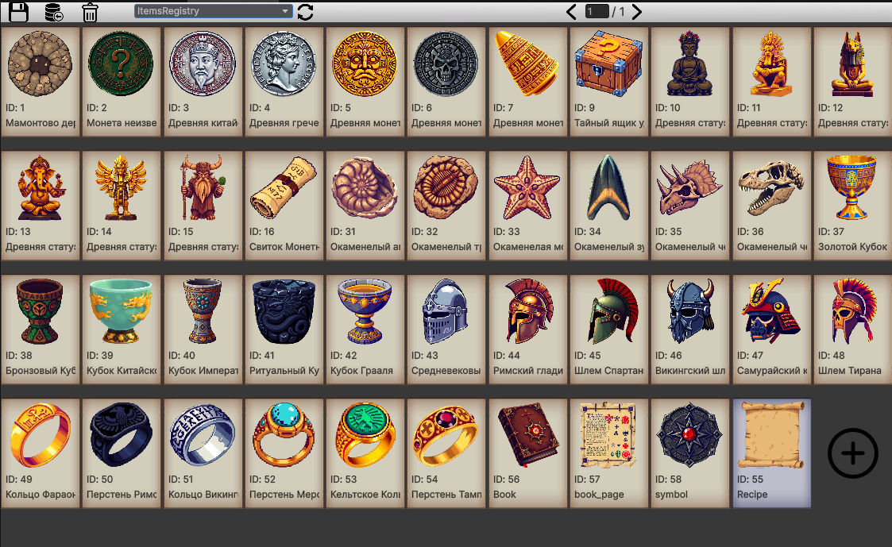

## Introduction

This Unity plugin provides a convenient tool for organizing and managing game data. It allows you to create and configure data object registries and manage them through a user-friendly interface in the Unity Editor.

### Features
- Create registries for various object types.
- Manage data through a UI window.
- Add, edit, and delete objects in the registry.
- Support for data filtering and sorting.

## Installation

1. In the **Project Manager** window, click **Install package from git URL**.  
2. Paste the following URL into the input field: https://github.com/ViachaslauBusel/UnityDataEditors.git?path=/Packages/com.object.registry.editor


## Creating a Registry
```csharp
 [CreateAssetMenu(fileName = "ItemsRegistry", menuName = "Data/ItemsRegistry")]
 public class ItemsRegistry : DataObjectRegistry<ItemData>
 {
 }
```
 
## Creating a Class to Store Data
Now create a class to store the data, implementing the IDataObject interface:
```csharp
  public class ItemData : ScriptableObject, IDataObject
  {
      [SerializeField, HideInInspector]
      private int _id;
      [SerializeField]
      private string _name;
      [SerializeField]
      private Texture _icon;

      public int ID => _id;
      public string Name => _name;
      public Texture Preview => _icon;

      public void Initialize(int id)
      {
          _id = id;
      }
  }
```
## Inheritance for Extended Functionality
If needed, you can create subclasses for more complex data types:
```csharp
public class WeaponItemData : ItemData
{
    [SerializeField]
    private int _damage;

    public int Damage => _damage;
}
```

## Usage

Create a registry instance through Unity’s context menu:
Right-click → Create → Data → ItemsRegistry.
Double-click the created registry object to open the management window:



## Using in Code
```csharp
public class SomeScript : MonoBehaviour
{
 [SerializeField]
 private ItemsRegistry _registry;

 private vois Start()
 {
   ItemData item = _registry.GetObjectByID(1);
   for (int i = 0; i < _registry.Objects.Count; i++)
   {
      Debug.Log($"Item: {_registry.Objects[i].Name}");
   }
 }
}
```
